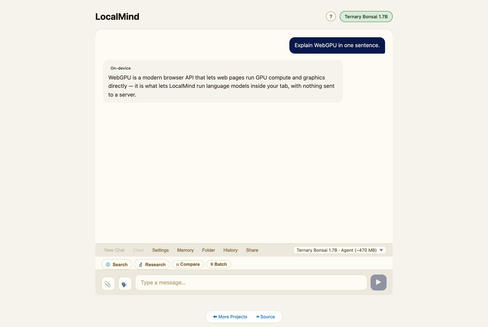

# LocalMind

**Private AI in your browser tab.** Chat, generate images, search the web, and talk to your documents — running entirely on your own device. No server, no API keys, no data leaving your machine.

**▶ [Try it live](https://naklitechie.github.io/LocalMind)**  ·  **[Guided tour](https://naklitechie.github.io/LocalMind/guide/)**



## What is it?

LocalMind is a single web page that runs real AI models **on your own device**. Open the link, pick a model, and start chatting — the model downloads once, caches in your browser, and works offline after that. Your conversations, files, and memory never leave your machine.

It began as a private chatbot and grew into a small **AI workbench**: chat, image generation, document Q&A, web research, and voice — all local.

> **The promise: no server · no API keys · no data leaving your device.** The only thing that ever touches the network is a web search — and only when *you* press the search button.

## What you can do

- 💬 **Chat with private local models** — several to choose from, from a tiny ~470 MB model up to multi-GB ones. They reason, write, and code.
- 🎨 **Generate images** — text-to-image on your GPU, right in the tab.
- 🌫️ **Watch text "denoise"** — an experimental diffusion-text mode (a different way of generating).
- 🌐 **Search the web** *(optional)* — bring your own free search key; answers come back with clickable sources.
- 📄 **Chat with your documents** — drop in PDFs, Word docs, notes, or a whole folder and ask questions across them. It remembers across sessions.
- 🖼️ **See & hear** — some models accept images and audio; voice-to-text works on any model.
- 🧠 **It remembers** — a private, on-device memory you can browse, search, and tidy up.
- 🔌 **Use *any* model** — point it at your own Ollama / LM Studio, or load a GGUF model straight into the tab.
- 📱 **Phone to desktop** — installable as an app; works offline.

*Every feature, in detail → [FEATURES.md](./FEATURES.md).*

## Three ways to run a model

Pick whatever fits your hardware — all three are local, nothing leaves your device:

| | How it runs | Best for |
|---|---|---|
| **In your browser** | On your GPU via WebGPU — zero setup | The private default; nothing to install |
| **In-browser GGUF** | A GGUF model loaded into the tab (llama.cpp → WebAssembly) | The huge GGUF ecosystem, no setup; runs on CPU even without a GPU |
| **Your own server** | Point it at Ollama / LM Studio on your machine | Big models (7B–70B+) at full speed |

## Try it in 30 seconds

1. Open **[naklitechie.github.io/LocalMind](https://naklitechie.github.io/LocalMind)** in Chrome or Edge.
2. Pick a model — the default is small (~470 MB).
3. Wait for the one-time download, then chat.

To run it yourself, it's one HTML file with no build step:

```bash
python3 -m http.server 8080   # then open http://localhost:8080
```

No dependencies, no backend. (Needs an HTTP server — it won't run from a `file://` path.)

## Privacy

Everything runs on your device. Models download from Hugging Face once and cache locally; after that you can go fully offline. There's no account, no telemetry, no backend. Web search is opt-in and uses *your* key, sent straight from your browser to the provider you chose.

## Browser support

Works in **Chrome / Edge 113+** and **Firefox 130+** — in-browser models need WebGPU (the "your own server" mode works without it). Safari's WebGPU support isn't there yet.

## Learn more

- 📖 **[Full feature guide](./FEATURES.md)** — models, agent tools, memory, web search, batch, sharing, MCP, custom models, and more
- 🛠️ **[How it works](./ARCHITECTURE.md)** — architecture, the runtimes, workers, and tech stack
- 🧑‍💻 **[Developer API](./API.md)** — drive the model from your own page (`window.localmind`)
- 🗺️ **[Roadmap](./ROADMAP.md)** — what's shipped and what's next

---

## Part of the NakliTechie series

A growing collection of browser-native tools that run entirely on your device — no server, no data leaving your machine. Full portfolio: **[naklitechie.github.io](https://naklitechie.github.io/)**.

Built by [Chirag Patnaik](https://github.com/NakliTechie) · MIT licensed · with [Claude Code](https://claude.com/claude-code).
