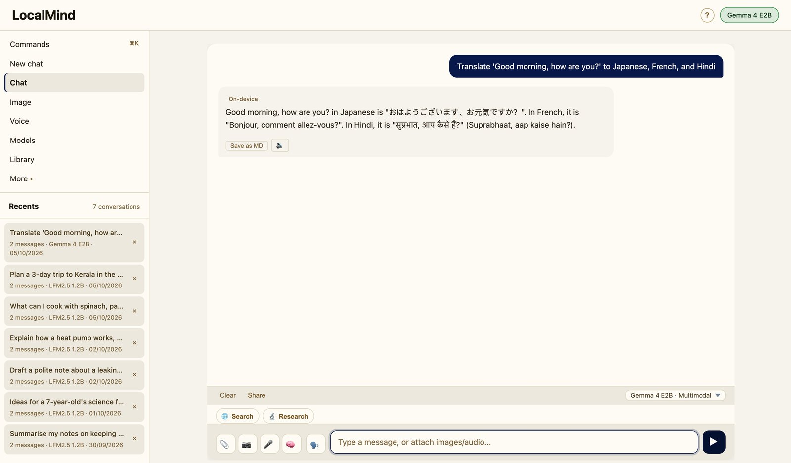

<h1 align="center">LocalMind</h1>

<p align="center"><b>Private AI in your browser tab. Chat, make images, talk to your documents and use your voice,<br>with the models running on your own device.</b></p>

<p align="center">A static web page with no build step. Chrome, Edge or Firefox with WebGPU. No account, no server, no telemetry.</p>

<p align="center">
  
  
  
  
</p>

<p align="center"></p>

## Install

| Where | How |
|---|---|
| Your browser | Open **[localmind.naklitechie.com](https://localmind.naklitechie.com)** in Chrome or Edge 113+, or Firefox 130+ |
| Your own copy | `git clone https://github.com/NakliTechie/LocalMind && cd LocalMind && python3 -m http.server 8080` |

On first open LocalMind downloads LFM2.5 230M (~140 MB) once and keeps it in the browser's cache, so the next start
skips the download; where Chrome already has Gemini Nano, it starts on that with no download. Tap an example prompt or
type. The model picker above the message box lists what is already on this device first; pick a bigger model when you
want more. To drive the loaded model from a script, turn on Settings → JavaScript API:

```js
await window.localmind.load('lfm2-230m-webgpu');
const r = await window.localmind.chat.completions.create({ messages: [{ role: 'user', content: 'Hello' }] });
```

No account, no API key, no config file. Your own copy needs an HTTP server; `file://` will not load the workers.

## Why

You want help with things you would rather not paste into a website: a contract, your notes, a letter from the doctor.
A hosted chatbot sends every word to someone else's server. LocalMind runs the model inside your browser tab instead.
Models download once from Hugging Face; what you type, the files you add and the memory it keeps stay on your machine.
Web search is the one exception, and it runs only when you turn it on, with your own search key.

In-tab models need WebGPU, so Safari does not work yet. Small models answer in seconds on a laptop. Ternary Bonsai 2 27B
is a ~5.9 GB download and needs a GPU with the memory to hold it. For 7B–70B models at full speed, point LocalMind at
your own Ollama, LM Studio or llama.cpp server; the browser then only streams the answer.

## Find your way around

The sidebar holds Chat, Image, Voice, Models and Library; Compare, Batch, Diffuse, OCR, Vision, Clone and Folder sit
under More. Press ⌘K (Ctrl+K on Windows and Linux) for a palette of every action, from switching models to opening a
setting. Library searches the full text of every saved chat, with your on-device memory in the tab beside it.

Settings → General → Appearance picks light, dark or your system's theme. On a phone the composer gets the full width,
with attach and voice stacked beside a taller text box, and everything else moves into the menu.

## Pick a model, or bring your own

The picker groups models as on this device, partly downloaded, or to download, with each size. They range from LFM2.5
230M on hand-written WebGPU kernels (~1,060 tokens/s on an M4 Pro) to Ternary Bonsai 2 27B, plus Chrome's built-in
Gemini Nano with no download at all. Two experimental engines stream mixture-of-experts models larger than GPU memory
(Qwen3.6 35B-A3B, Gemma 4 26B-A4B) from the browser's private storage. Their disk tier and engines are also a library,
[diskformer.js](https://github.com/NakliTechie/diskformer.js), with a demo at
[diskformer.naklitechie.com](https://diskformer.naklitechie.com).

Every path is local. A model runs in the tab on WebGPU, or as a GGUF through llama.cpp compiled to WebAssembly (from a
URL or a `.gguf` file on your disk, on CPU when there is no GPU), or on your own Ollama, LM Studio or llama.cpp server.
Settings → Models adds any Hugging Face ONNX repo or GGUF URL to the picker.

## Documents, images and voice

Drop PDFs, Word files, notes or a whole folder into a chat and ask across them, in one language about documents in
another. LocalMind remembers between sessions. OCR turns photos and scanned PDFs into selectable text with GLM-OCR on
your GPU. Image mode draws with a 4B diffusion model in the tab, or sends the prompt to your own stable-diffusion.cpp
server for bigger models.

Voice mode is hold-to-talk: Moonshine transcribes, the model answers and Kokoro reads the reply aloud. Clone makes any
text sound like a 5–10 second voice sample, with Chatterbox. Each model downloads once and runs on your device.

## Commands

```bash
python3 -m http.server 8080              # serve your copy, then open http://localhost:8080
scripts/image-server.sh                  # a local stable-diffusion.cpp server for Image mode on 127.0.0.1:7860
node scripts/bench-engines.mjs           # decode tok/s per engine: drives Chrome, same model and prompt, exact token counts
node scripts/test-inference-worker.mjs   # UI and worker contracts (the full gate is below)
node scripts/roll-in.mjs                 # after editing a module in src/: copy every module into index.html
```

With Settings → JavaScript API on, `window.localmind` is an OpenAI-shaped client for the loaded model, and
`window.localmind.commands` lists and runs every ⌘K palette command ([API.md](docs/API.md)).

## Verify it yourself

```bash
for t in rollin download-stall endpoint engine-fetch inference-worker moe-expert-stream token-count; do
  node scripts/test-$t.mjs || { echo "FAILED: $t"; break; }
done
```

These seven suites need Node and nothing else: no install, no model download, no browser. They refuse a page that
loads any script file besides itself (every module in `src/` is rolled into `index.html`), a sidebar or
palette command that maps to no real control, a model without its Settings entry, a load failure that shows no Retry,
a truncated model download that the cache would keep, and a token estimate outside its bounds against each model's
own tokenizer. Two more suites drive Chrome with WebGPU: `scripts/test-qwen35-kernels.mjs` checks the SSD engine's
WGSL kernels against llama.cpp's CPU ops, and `scripts/test-ple-opfs.mjs` checks Gemma 4 gives identical output with
its embedding table on disk. `bench-engines.mjs --suite dflash` checks DFlash 2 output is byte-identical to plain decoding.

## License

MIT. Built on [Transformers.js](https://github.com/huggingface/transformers.js) and the
[webml-community](https://huggingface.co/webml-community) WebGPU kernels; full credits in
[ARCHITECTURE.md](docs/ARCHITECTURE.md#credits). Part of the [NakliTechie](https://naklitechie.github.io/) series, built
by [Chirag Patnaik](https://github.com/NakliTechie) with [Claude Code](https://claude.com/claude-code).

[Features](docs/FEATURES.md) · [Architecture](docs/ARCHITECTURE.md) · [API](docs/API.md) · [Roadmap](docs/ROADMAP.md) · [Guided tour](https://naklitechie.github.io/LocalMind/guide/)
